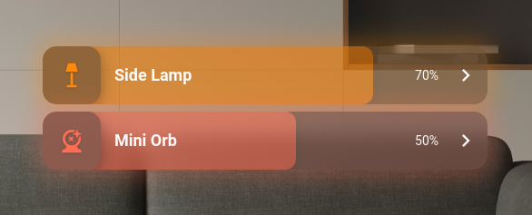

# Compact Light Card
[](https://github.com/goggybox/compact-light-card/releases)
[](https://github.com/hacs/integration)

A clean, compact, and highly customisable light card for Home Assistant.




## Features
- Click and drag to increase/decrease the brightness of a dimmable bulb.
- The card takes the same colour as the light, or a default orange colour for bulbs that don't support colour changing (as seen with the "Salt Lamp" in the image below). The primary and secondary colour of the card can be customised.
- Click on the light's icon to toggle the light on/off.
- Click on the chevron to open the "More Info" page for the light. This behaviour can be customised.

## Customisation


The image above shows the default configuration for the card. By default, the card will have a subtle glow when the light is on, of the same colour as the bulb (or a default orange). When the light is off, the card uses standard theme colours.

The following customisations are available:

### Basic Settings

- `name: "Light 1"` sets the displayed name to "Light 1".
- `icon: "mdi:lamp"` sets a custom icon (default: `mdi:lightbulb`).
- `height: 50` sets the card height in pixels. (default: `64`, range: `30-150`)
- `font_size: 14` sets the font size in pixels. (default: `18`, range: `8-36`)

### Colours

- `primary_colour: "#dbdbdb"` sets the card's primary colour to "#dbdbdb".
- `secondary_colour: "#808080"` sets the card's secondary colour to "#808080".
- `icon_background_colour: "#2196F3"` sets the icon background colour independently from the light's colour.
- `glow: false` disables the glow around the card.
- `smart_font_colour: false` disables the smart font colour feature. (This feature determines whether the font is white or black depending on the contrast with the background)

### Off State Colours

- `off_colours:` customises the colour of the card background and text when the light is off.
  ```yaml
  off_colours:
    background: "#e0e0e0"
    text: "#e0e0e0"
  ```
  You can also set separate colours for light vs dark mode:
  ```yaml
  off_colours:
    light:
      background: "#e0e0e0"
      text: "#e0e0e0"
    dark:
      background: "#8a8a8a"
      text: "#8a8a8a"
  ```

### Borders

- `icon_border: true` enables a border around the light icon, as can be seen in the "Salt Lamp" and "Mini Orb" cards in the above example.
- `icon_border_colour: "#e0e0e0"` sets the icon border colour to "#e0e0e0".
- `card_border: true` enables a border around the card, as can be seen in the "Mini Orb" card in the above example.
- `card_border_colour: "#e0e0e0"` sets the card border colour to "#e0e0e0".

### Opacity & Blur

The opacity settings allow you to control transparency of the card and icon separately, and differently based on whether the light is on or off.

- `opacity: 0.5` sets the fallback/default card opacity. (range: `0.0-1.0`)
- `opacity_on: 0.8` sets the card opacity when the light is **on**. Overrides `opacity`.
- `opacity_off: 0.3` sets the card opacity when the light is **off**. Overrides `opacity`.
- `icon_opacity: 0.9` sets the fallback/default icon opacity. If not set, auto-calculates from `opacity × 1.5` (clamped between 0.3 and 1.0).
- `icon_opacity_on: 1.0` sets the icon opacity when the light is **on**. Overrides `icon_opacity`.
- `icon_opacity_off: 0.5` sets the icon opacity when the light is **off**. Overrides `icon_opacity`.
- `blur: 3` gives the card a blurred, "frosted" effect. Only visible if card is also transparent. (range: `0.0-10.0`)

**How opacity priority works:**

| Settings | Light ON uses | Light OFF uses |
|----------|---------------|----------------|
| Only `opacity: 0.5` | 0.5 | 0.5 |
| `opacity: 0.5` + `opacity_off: 0.3` | 0.5 | 0.3 |
| `opacity_on: 0.8` + `opacity_off: 0.3` | 0.8 | 0.3 |
| All three set | `opacity_on` | `opacity_off` |

The same logic applies to icon opacity settings.

### Icon Tap Behaviour

- `icon_tap_to_brightness: true` enables turning on the light to a specific brightness when tapping the icon (instead of the previous brightness).
- `turn_on_brightness: 50` sets the brightness percentage (1-100) to use when `icon_tap_to_brightness` is enabled. Default is 100.

When `icon_tap_to_brightness` is enabled:
- Tapping the icon when the light is **off** turns it on to the specified `turn_on_brightness` percentage
- Tapping the icon when the light is **on** turns it off
- The slider continues to work as normal for fine-grained brightness control

Example:
```yaml
type: custom:compact-light-card
entity: light.bedroom
icon_tap_to_brightness: true
turn_on_brightness: 50
```

### Color Mode Controls

For lights that support color temperature and/or RGB color, mode toggle buttons appear to the right of the slider. These allow you to switch between controlling brightness, color temperature, or color hue.

- `show_color_temp_button: true/false` - Show/hide the color temperature button (default: `true` if light supports it)
- `show_rgb_button: true/false` - Show/hide the RGB color button (default: `true` if light supports it)

**Mode behavior:**
- **Brightness mode** (sun icon): Slider controls brightness 1-100%
- **Color Temperature mode** (thermometer icon): Slider controls color temperature from warm (left) to cool (right)
- **RGB/Color mode** (palette icon): Slider controls hue 0-360° through the color spectrum

The mode buttons only appear when:
1. The light supports that color mode
2. The corresponding `show_*_button` config is not set to `false`
3. There are at least 2 modes available (buttons are hidden if only brightness is supported)

Example:
```yaml
type: custom:compact-light-card
entity: light.bedroom
show_color_temp_button: true
show_rgb_button: false  # Hide RGB button even if supported
```

### Chevron Actions

- `chevron_action:` customises the action performed when the chevron is clicked. Default HA action configuration is expected:
  ```yaml
  chevron_action:
    action: url
    url_path: https://github.com/goggybox/compact-light-card/
  ```
  The supported actions are `more-info`, `toggle`, `navigate`, `url`, and `perform-action`/`call-service`.
- `chevron_double_tap_action:` customises the action performed when the chevron is double clicked, configured the same way as `chevron_action:`. By default, there is no action configured for a double tap.
- `chevron_hold_action:` customises the action performed when the chevron is held, configured the same way as `chevron_action:`. By default, there is no action configured for a hold.

### Full Example

```yaml
type: custom:compact-light-card
entity: light.living_room
name: "Living Room"
icon: mdi:ceiling-light
height: 56
font_size: 16
primary_colour: "#ff6b35"
icon_background_colour: "#1a1a2e"
glow: true
opacity_on: 0.9
opacity_off: 0.4
icon_opacity_on: 1.0
icon_opacity_off: 0.6
icon_tap_to_brightness: true
turn_on_brightness: 75
chevron_action:
  action: more-info
```

Examples of the customisations:


## Installation (using HACS)

Use this link to open the repository in HACS:

[](https://my.home-assistant.io/redirect/hacs_repository/?owner=goggybox&repository=compact-light-card)

Alternatively:

- Open HACS in Home Assistant.
- Search for "Compact Light Card".
- Ensure the result has the creator as "goggybox".
- Click download!

## License
GPLv3.0 © [goggybox](https://github.com/goggybox)
