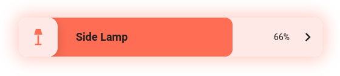
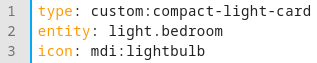
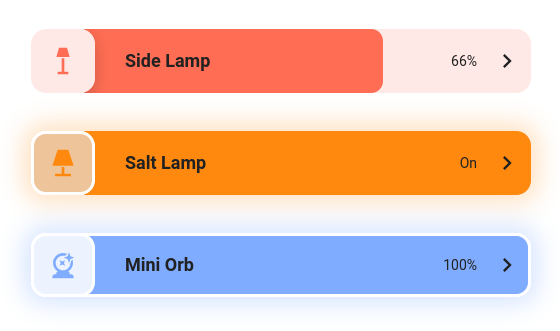

# Compact Light Card
[](https://github.com/goggybox/compact-light-card/releases)
[](https://github.com/hacs/integration)

A clean, compact, and highly customisable light card for Home Assistant.


## Features
- Click and drag to increase/decrease the brightness of a dimmable bulb.
- The card takes the same colour as the light, or a default orange colour for bulbs that don't support colour changing (as seen with the "Salt Lamp" in the image below). The primary and secondary colour of the card can be customised.
- Click on the light's icon to toggle the light on/off.
- Click on the chevron to open the "More Info" page for the light. This behaviour can be customised.

## Customisation


The image above shows the default configuration for the card. By default, the card will have a subtle glow when the light is on, of the same colour as the bulb (or a default orange). When the light is off, the card uses standard theme colours.

The following customisations are available:

- `name: "Light 1"` sets the displayed name to "Light 1".
- `primary_colour: "#dbdbdb"` sets the card's primary colour to "#dbdbdb".
- `secondary_colour: "#808080"` sets the card's secondary colour to "#808080". 
- `glow: false` disables the glow around the card.
- `icon_border: true` enables a border around the light icon, as can be seen in the "Salt Lamp" and "Mini Orb" cards in the above example.
- `icon_border_colour: "#e0e0e0"` sets the icon border colour to "#e0e0e0".
- `card_border: true` enables a border around the card, as can be seen in the "Mini Orb" card in the above example.
- `card_border_colour: "#e0e0e0"` sets the card border colour to "#e0e0e0".
- `off_colours:` customises the colour of the card background and text when the light is off.
  ```
  off_colours:
    background: "#e0e0e0"
    text: "#e0e0e0"
  ```
  You can also set separate colours for light vs dark mode:
  ```
  off_colours:
    light:
      background: "#e0e0e0"
      text: "#e0e0e0"
    dark:
      background: "#8a8a8a"
      text: "#8a8a8a"
- `chevron_action:` customises the action performed when the chevron is clicked. Default HA action configuration is expected:
  ```
  chevron_action:
    action: url
    url_path: https://github.com/gogybox/compact-light-card/
  ```
  The supported actions are `more-info`, `toggle`, `navigate`, `url`, and `perform-action`/`call-service`.

Examples of the customisations:



## Installation (using HACS)

Use this link to open the repository in HACS:

[](https://my.home-assistant.io/redirect/hacs_repository/?owner=goggybox&repository=compact-light-card)

Alternatively:

- Open HACS in Home Assistant.
- Search for "Compact Light Card".
- Ensure the result has the creator as "goggybox".
- Click download!

## License
MIT © [goggybox](https://github.com/goggybox)
